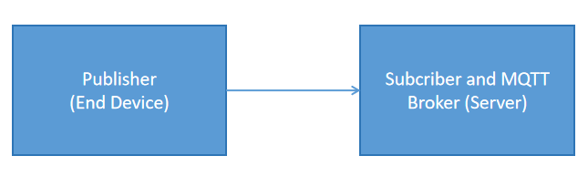

# MQTT Base Program With ESP32

MQTT (Message Queuing Telemetry Transport) is a lightweight publish/subscribe based communication protocol specifically designed for communication between low-power devices.
The MQTT consists of 3 parts, namely publisher, broker, and subscriber. The function of the broker is to handle communication between the sender (Publisher) and the recipient of the message (Subcriber).

This github topic discusses the application of the MQTT protocol for sending data from end devices to servers.
Here's the MQTT section: 
* Publisher : end device (ESP32)
* Broker and Subscriber : Jetson nano (Ubuntu/Linux)
In this project, Jetson Nano acts as a server that receives data from end devices as well as an MQTT broker.




## Installation
Spesification of server (broker and subcriber) description : Python 3.8
* Open terminal on Jetson Nano or PC (Linux/Ubuntu base)
```bash
sudo apt-get update
sudo apt-get upgrade
sudo apt install mosquitto mosquitto-clients
```
* Test MQTT installation
Open 2 terminals and write the syntax in each terminal.

First terminal  
```bash
mosquitto_sub -h localhost -t test
```
Second terminal 
```bash
mosquitto_pub -h localhost -t test -m "hello world"
```
If the 'hello world' data sent by the second terminal has been entered in the first terminal, it indicates that the MQTT installation has been successful.

 * After MQTT is successfully installed and running, then create a username and password for the broker in the terminal
```bash
sudo mosquitto_passwd -c /etc/mosquitto/passwd username
```
*Fill in the username field with the username 
After the syntax above is entered then fill in the password to be created.
Creating an MQTT broker username and password is an optional option, can be used and may not be used. If you do not use the MQTT broker username and password, you can skip this step.

* Then restart MQTT
```bash
sudo systemctl restart mosquitto
```


## Running Program
* Upload program ESP32 with Arduino IDE
Select one of the following options:
Without username and password MQTT broker
upload mqtt_jetsonbroker_nonuser.ino
With username and password MQTT broker
upload mqtt_jetsonbroker_withuser.ino

* Runnning python program in terminal server (Subcriber and broker)
Without username and password MQTT broker
```bash
python3 mqtt_jetsonbroker_nonuser.py
```
With username and password MQTT broker
```bash
python3 mqtt_jetsonbroker_withuser.py
```
## Authors

- [@Yumnasilvia](https://github.com/Yumnasilvia)
- [@wnwdwn06](https://github.com/wnwdwn06)

